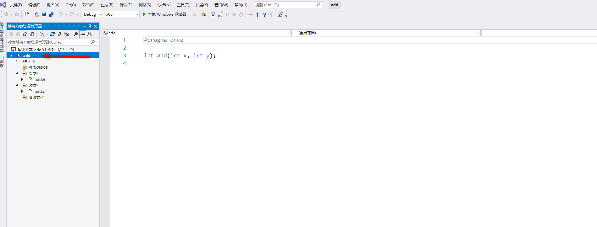
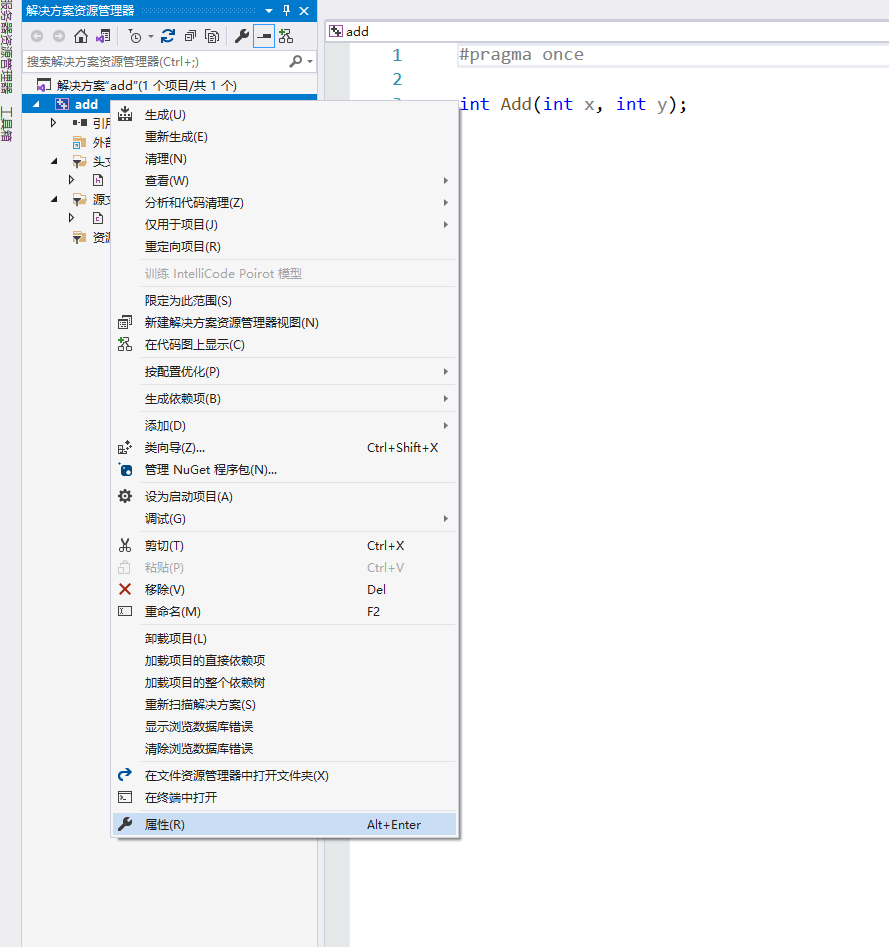
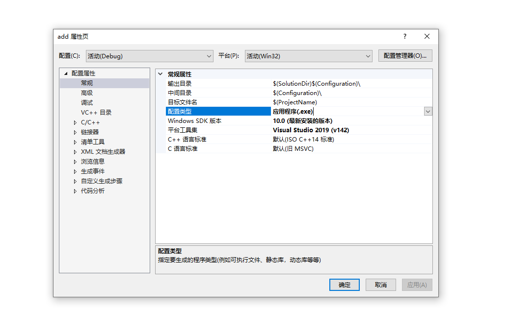
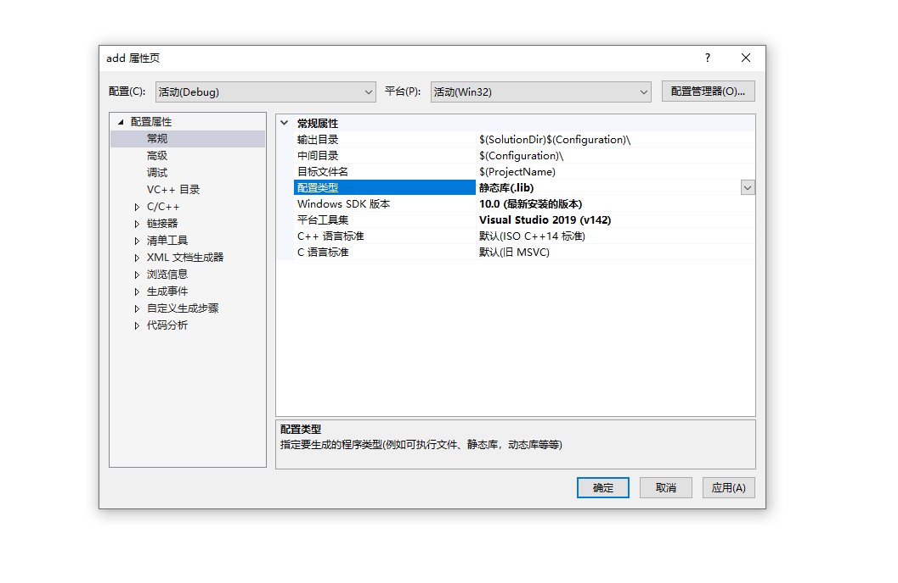
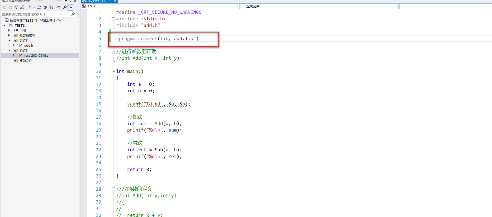

什么是C语言

第一个C语言程序

数据类型

变量、常量

低级语言，高级

汇编指令，B语言，C语言

10001010 ADD 高级语言

C语言的国际标准

ANSI

C89 C90 C99 C11

C89 C90

编译器 Clang GCC WIN-TC SUBLIME MSVC TURBO C

编辑器和编译器不一样

Ctrl+F5 开始执行不调试。F5是调试

3\\ 数据类型

Char

Short 短整型

Int

Long

Long long

Float 单精度浮点型

Double 双精度浮点型

为什么写代码

为了解决生活中的问题，购物、点餐、看电影、

书 鹏哥C语言的书记 66块。

66 是整数 整型

66.6小数 浮点型

书名 字符串 字符型

Openwrt@\#

6.66

**Ctrl** + **K**, 在**Ctrl** + **C**: 将选中的行全部注释

**Ctrl** + **K**, **Ctrl** + **U**: 取消选中的行的注释

计算机中的单位

Bit 比特位

Byte 字节

Kb

Mb

Tb

pb

计算机能理解二进制

我们生活在十进制的世界

0\~9

66

二级制的世界

只有0 1

八进制

0\~7

十六进制

0\~F F是15

8个bit等于1byte

00 0

01 1

10 2

11 3

向内存申请空间

创建变量的本质是向内存申请空间

变量和常量

变量的分类

局部变量

全局变量

当全局变量和局部变量名字相同时，局部变量优先

\_CRT_SECURE_NO_WARNINGS

在源文件的第一行放\#define \_CRT_SECURE_NO_WARNINGS

Scanf 这个是VS编译器自己提供的函数，非标准C提供的函数，那也就是只有VS编译器能认识

如果你非要使用scanf_s 请你研究一下再使用

在VS安装路径下 newc++file.cpp文件

在VS工程中创建新的.c或者.cpp文件的时候，都是拷贝new

变量的作用域和变量的生命周期

1.  局部变量 限定这个名字的可用性的代码
2.  全局变量

变量的生命周期

局部变量的生命周期是：进入作用域生命周期开始，出作用域生命周期结束

全局变量

在生个生命周期都是存在的，都是你可以用的

字面常量

Const 修饰的常变量

不能再修改

1.  枚举常量

4字符串+转义字符+注释

Ctrl +F10 调试模式，打开监视窗口

栈区，堆区，静态区

影响了变量的生命周期，生命周期变长，和程序的生命周期一样

一个内存单元的大小是一个字节

32位电脑

XXXX XXXX XXXX XXXX XXXX XXXX

.h .c编译成静态库

配置编译出静态库lib

改为

Ctrl+ F7

Ctrl+F5

<https://www.bilibili.com/video/BV1Vm4y1r7jY/?p=44&spm_id_from=pageDriver&vd_source=afe65db66339e30b541134f2a216daaa>

把.h和.lib放到

加上这句函数

函数的栈帧的创建和销毁

数组的编号是从0开始的

判断输赢

算法的实现
